* [General info](#general-info)
* [Tech Stack](#tech-stack)
* [Application view](#application-view)
* [Postman](#postman)
* [Docker](#docker)
* [Backend](#backend)

## General info
In the application, WebSockets were utilized for real-time communication, and a PostgreSQL database was employed for persistent data storage. The management of database migrations was facilitated through the use of the Flyway tool. The application enables users to register and confirm their registration via email, provided that no account has been created with their email address before. Users also have the option to reset their passwords and log in using a username and password. Authentication and authorization in protected areas of the application are implemented using JSON Web Tokens.

One of the most significant features of this application is the capability for users to communicate directly with each other. Through the WebSocket protocol, users can send messages and engage in real-time conversations. Additionally, users can conduct video conversations directly through the application.

## Tech Stack
<ul>
<li>Java</li>
<li>Spring Boot</li>
<li>PostgreSQL</li>
<li>Flyway</li>
<li>Microservices</li>
<li>Websocket</li>
<li>Docker</li>
<li>WebRTC</li>
<li>Eureka Client</li>
<li>FTP Server</li>
</ul>

## Application view

    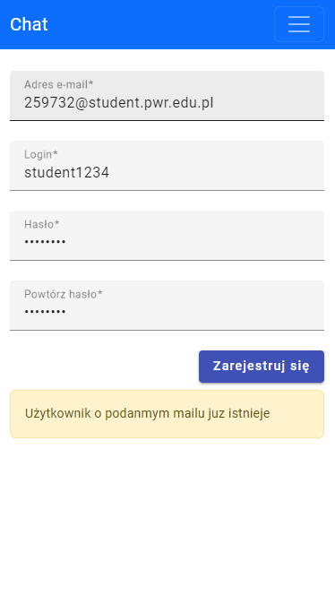
    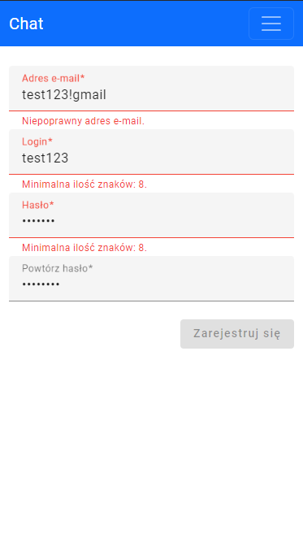
    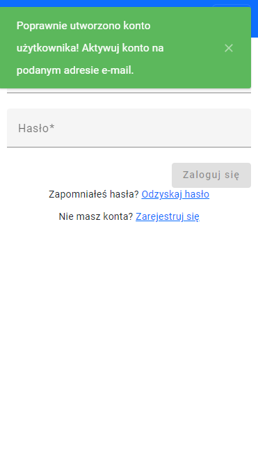
    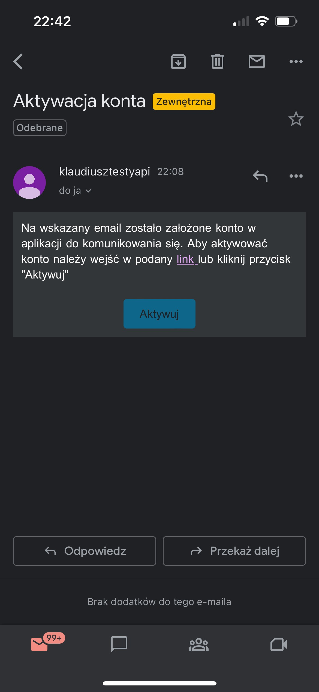
    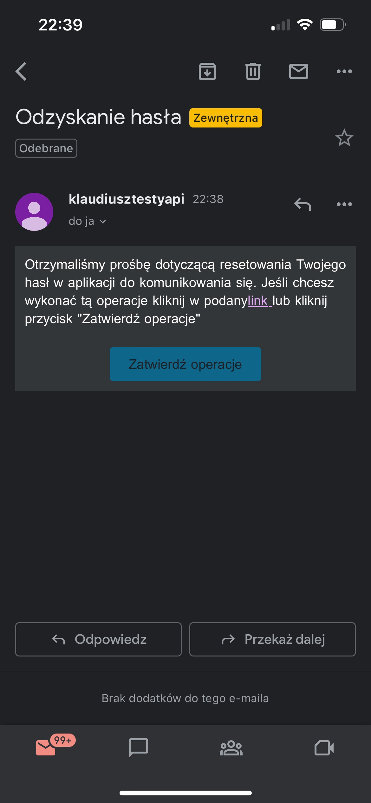
    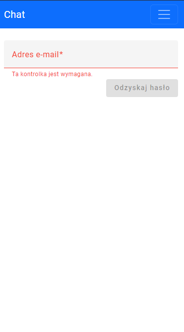
    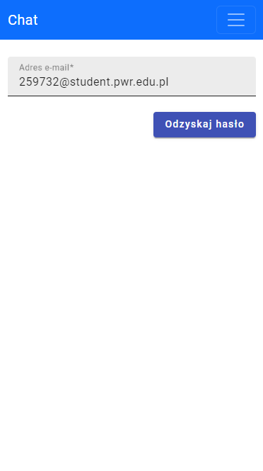
    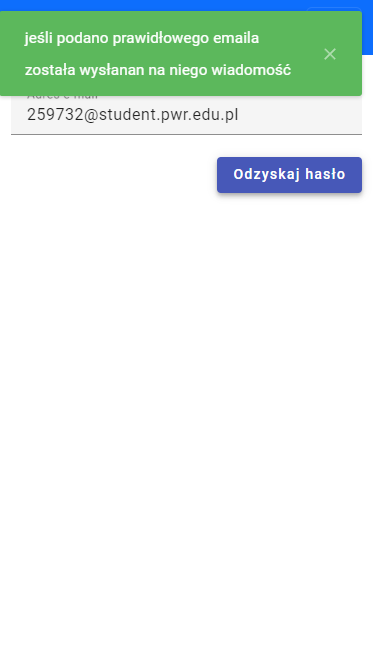
    
    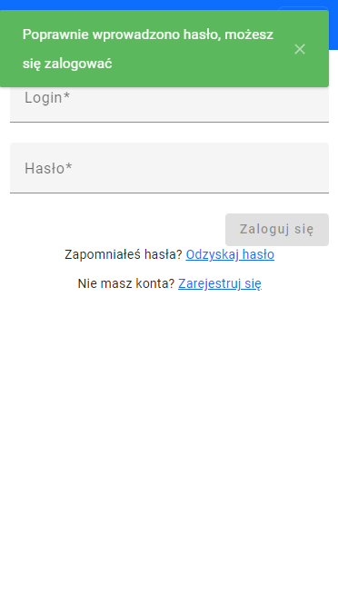
    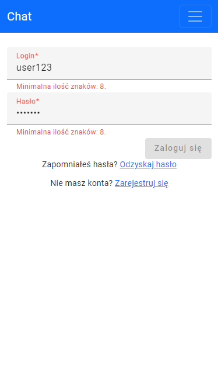
    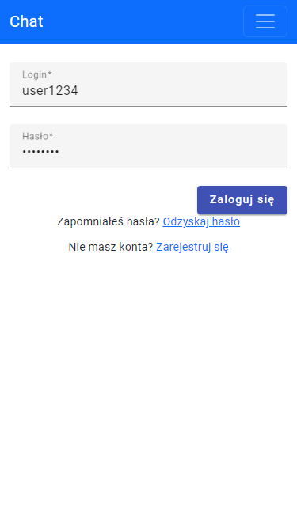
    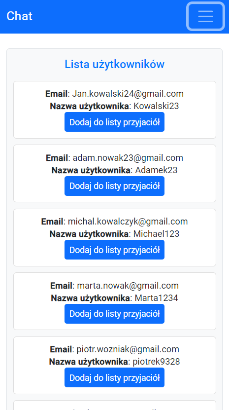
    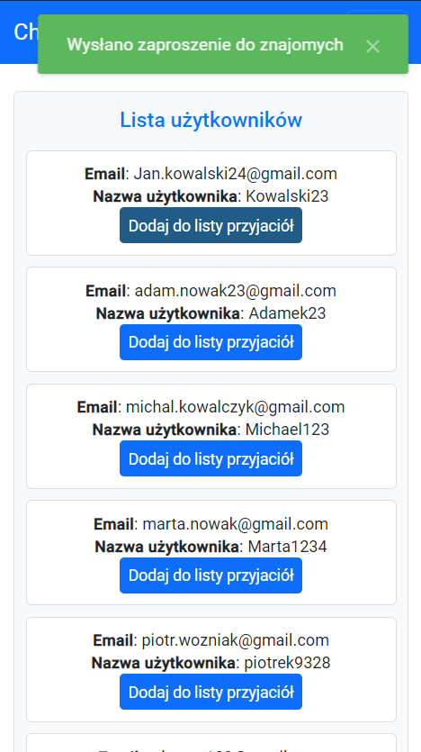
    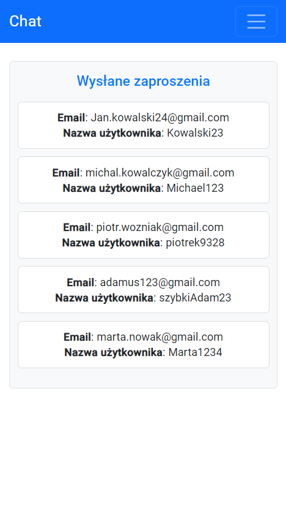
    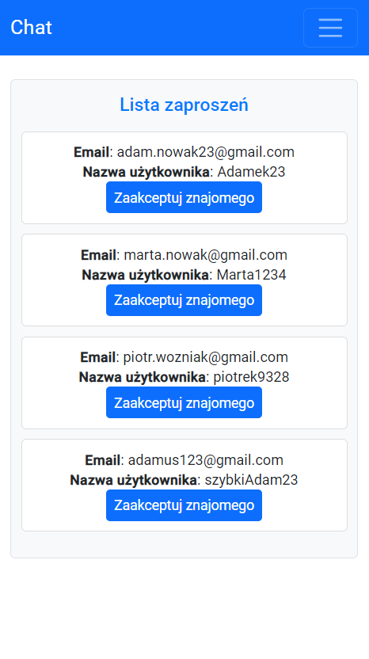
    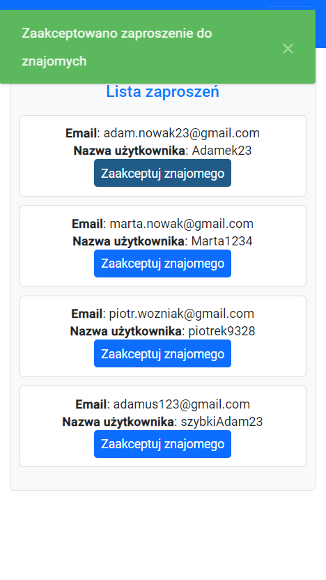
    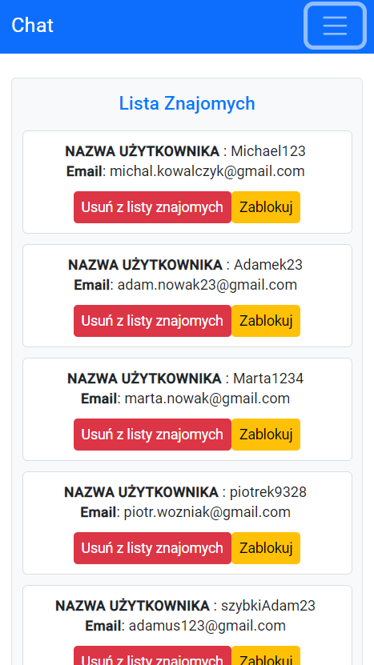
    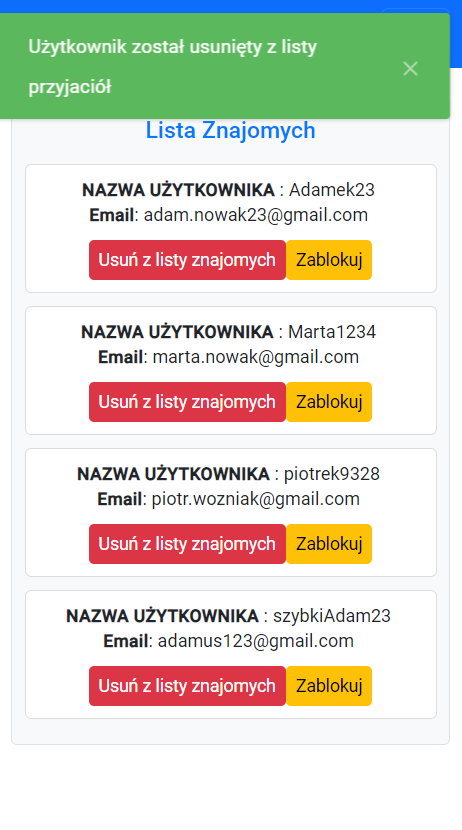
    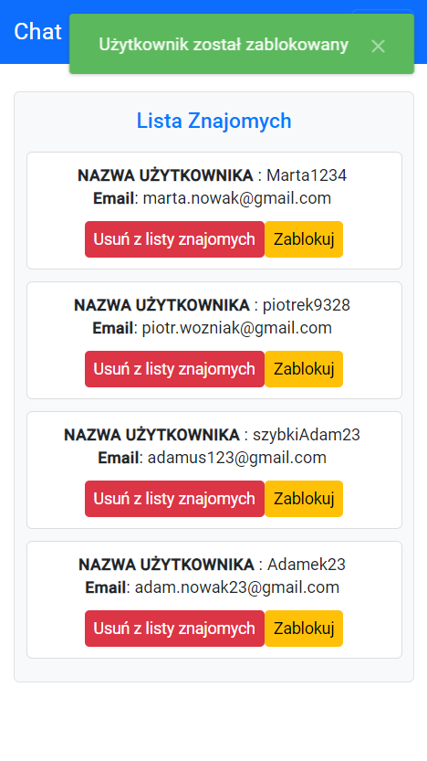
    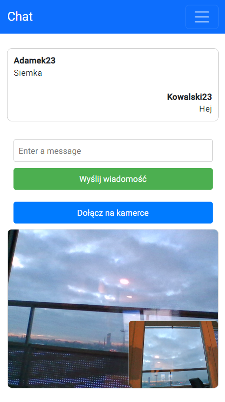

## Postman
Click [here](https://www.postman.com/payload-engineer-20476972/workspace/chat/collection/25380662-95bc8946-5118-49c6-b1b8-d188b95d4345?action=share&source=copy-link&creator=0) to go to the Postman collection.

## Docker
IN PROGRESS

Docker command to run database: docker run --name chatdb -p 5432:5432 -e POSTGRES_PASSWORD=chat -d postgres
docker run -d --name ftp -p 8001:21 -p 21000-21010:21000-21010 -e USERS="chat|12345678|/home/chat|10000" delfer/alpine-ftp-server

## Backend
Click [here](https://github.com/KlaudiuszKudla/Chat-backend-public) to go to the Backend.
